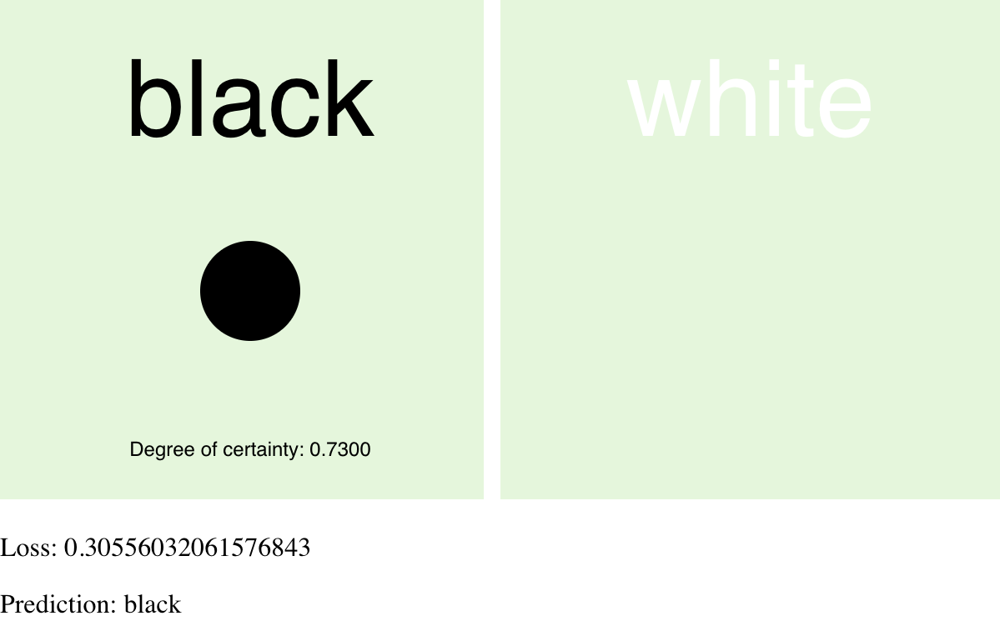
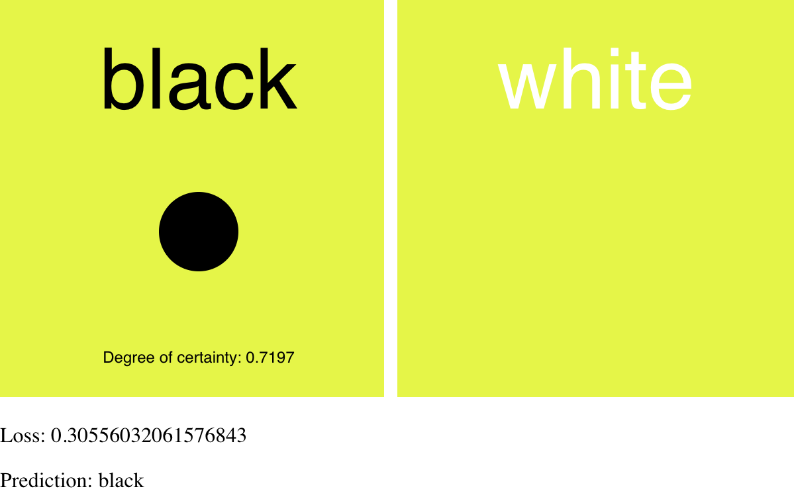
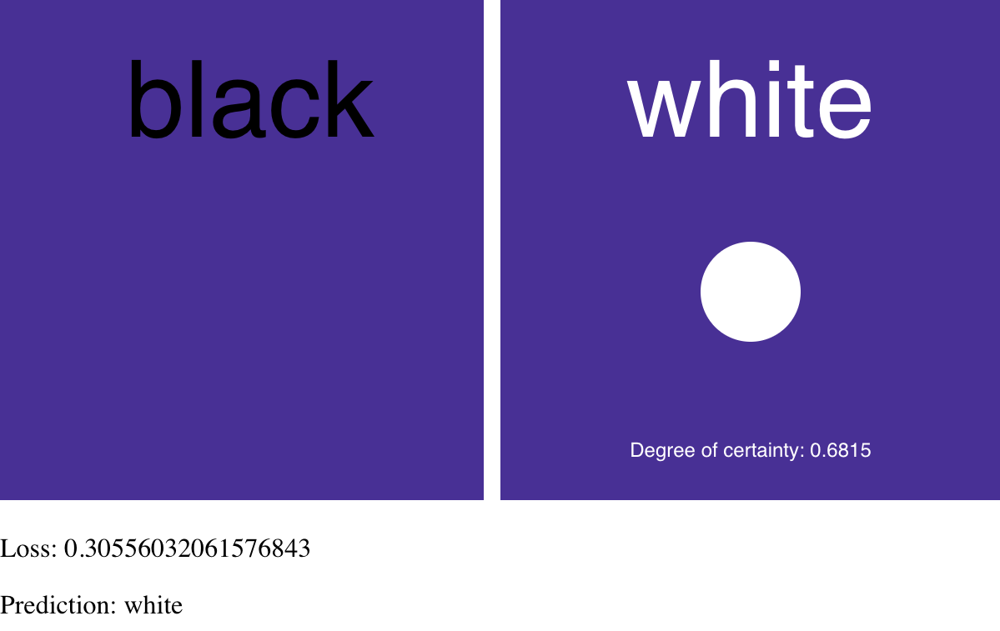
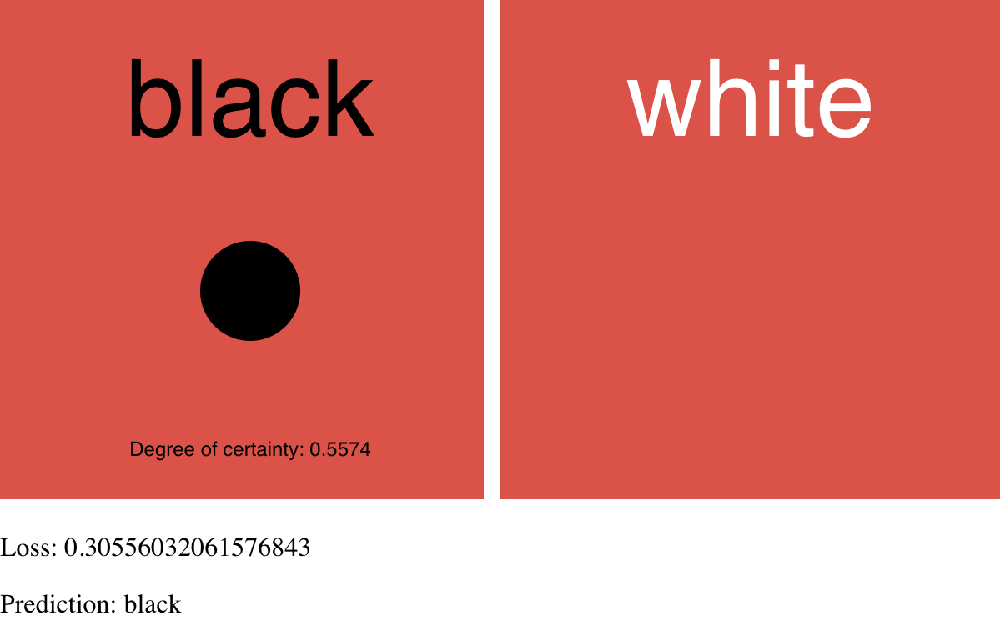
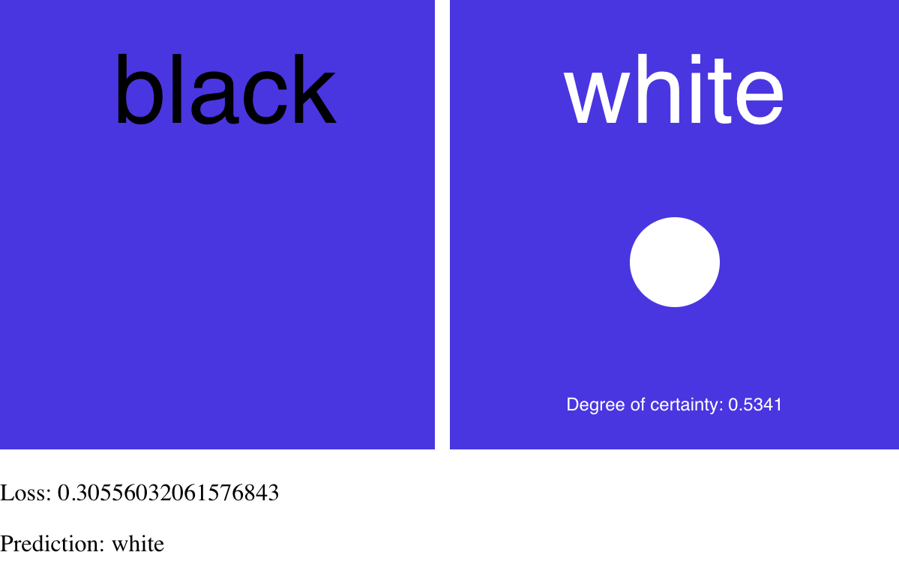
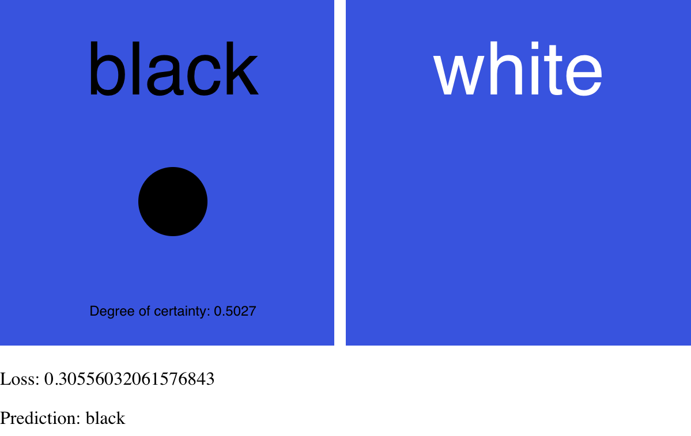

# Colour Predictor

Neural network that predicts whether white or black text is better suited to a given coloured background. This project is built with P5js and Tensorflow.js.

Based on Daniel Shiffman's Coding Train video example:
https://www.youtube.com/watch?v=KtPpoMThKUs

The code has been amended from the video example shown by building the Colour Predictor with the Tensorflow.js API.

 

  
  
  
  
  
  

